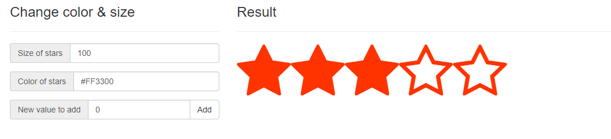

# react-rtstar (Version 2)

[](https://npmjs.org/package/react-rtstar)

react-rtstar is a react component to give you opportunity to make great and easy to use rating/notation system.

## Usage

This component is designed to be very easy to use.

### Import module

```javascript
import RtStar from 'react-rtstar'
```

### Add to your component

```javascript
<RtStar 
  values={your_values} 
  show={number_of_stars} 
  blankStar={blank_star_node} 
  fillStar={filled_star_node} />
```

# Screenshot



# Launch demo

1. Fork, download or clone this repository.
2. `cd react-rtstar && npm install`
3. `npm start`
4. Go to localhost:3000

## Props

| Name        | Type   | Description             | Default value | Required |
|-------------|--------|-------------------------|---------------|----------|
| values      | Array  | Array of values (notes) | []            | false    |
| show        | Number | Number of stars to show | 5             | false    |
| *blankStar* | Node   | Blank star icon node    |               | true     |
| *fillStar*  | Node   | Filled star icon node   |               | true     |
