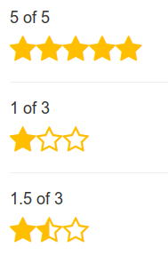

# react-rtstar

[](https://npmjs.org/package/react-rtstar)

react-rtstar is a react component to give you opportunity to make great and easy to use rating/notation system.
For the moment this version cannot allow you to edit your rating (no event support yet).

## Usage

This component is designed to be very easy to use.
You must include [**FontAwesome**](http://fontawesome.io/) to use **react-rtstar**

### Import module

```javascript
import RtStar from 'react-rtstar'
```

### Add to your component

```javascript
<RtStar value={your_value} max={max_stars} color={custom_color} size={custom_size} />
```

# Screenshot



# Launch demo

1. Fork, download or clone this repository.
2. `cd react-rtstar && npm install`
3. `npm start`
4. Go to localhost:3000 to have a preview of demo

## Props

| Name      | Type   | Description     | Default value | Required |
|-----------|--------|-----------------|---------------|----------|
| **value** | Number |                 | /             | true     |
| max       | Number | Number of stars | 5             | false    |
| color     | String | Color of stars  | #FFBF00       | false    |
| size      | Number | Size of stars   | 16            | false    |
